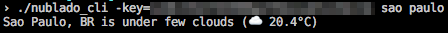

# nublado-cli
A Go CLI for checking weather

This is a WIP project with a simple and straightforward purpose. Checking weather via CLI. You can already play with it:



### Installing

1. Build the binary

```bash
go build nublado-cli.go
```

2. Done


### API

You'll need a valid API from https://openweathermap.org/api.

### Testing

```bash
OPENWEATHER_API_KEY=<api-key> go test
```


### This project targets

- Supporting multiple APIs :two_hearts:
- Having voice output :lips:
- Having emojis :rocket: :guitar:
- Opinioned responses your momma used to say when you'd go out without your jacket :roll_eyes:
